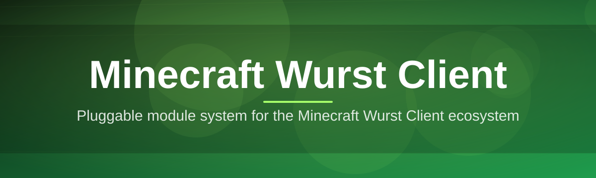
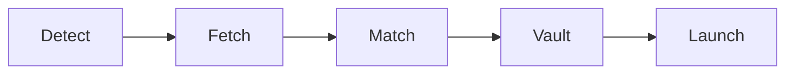

# minecraft-wurst-mod-manager 🧨🗡️

  

*One launcher to organize, update, and actually understand your Wurst Client setup — instead of babysitting jar files.*

## 🎯 Overview

Managing a Minecraft utility mod by hand is a chore nobody signs up for. You download a jar, drop it into a folder that already has three other versions in it, forget which one you're actually running, and then spend twenty minutes googling why your module list looks wrong. That's the actual problem here — not the mod itself, but the mess around it.

**minecraft-wurst-mod-manager** is a standalone Windows desktop app built specifically for people who run the Wurst Client and want a sane way to manage it. It tracks versions, handles Minecraft/Fabric compatibility pairing, keeps your module configs backed up between updates, and gives you one dashboard instead of five browser tabs and a Downloads folder full of `wurst-client-final-v2-REAL.jar`.

This is for the tinkerer crowd — people who run Wurst on a dedicated test instance, switch between Minecraft versions constantly, and care about *which* build they're on. If you've ever lost a custom module config because you overwrote the wrong folder, this tool exists because of you.

  

---

## 🧩 What It Actually Does For You

1. **Version shelving.** Every Wurst build you've ever fetched gets shelved by Minecraft version and Fabric loader pairing — no more manual folder archaeology.

2. **One-click swap.** Switch between Wurst versions or Minecraft versions without touching a config file. The manager rewires paths for you.

3. **Module config vaulting.** Your custom keybinds, HUD layout, and module toggles get snapshotted before every update — rollback is a button, not a prayer.

4. **Compatibility guardrails.** The manager flags mismatched Minecraft/Fabric/Wurst combos before you launch, not after your game crashes at the main menu.

5. **Changelog reader, built-in.** No more digging through Discord scrollback to figure out what changed between builds.

6. **Theme-aware dashboard.** Dark, light, and a genuinely good "midnight purple" theme that doesn't hurt to look at during a 2am session.

7. **Offline-first design.** Once a build is cached locally, the manager works with zero network dependency — no phoning home just to open the app.

8. **Zero background bloat.** No tray daemon, no auto-launch service, no telemetry pinging a server you didn't consent to.

> [!TIP]
> Pin a "default" build per Minecraft version so switching back and forth doesn't require re-selecting settings every time.

---

## 🚀 How To Get Started

1. **Visit the landing page** using the download button above.

2. **Download the installer** — it's a single standalone `.exe`, no bundled installers-within-installers.

3. **Run it once** to let it detect your existing Minecraft and Wurst installations automatically.

4. **Pick a build, launch, play.** The manager handles the wiring; you handle the module list.

> [!NOTE]
> First run takes a few extra seconds while the manager indexes your existing mod folders. This is normal, not a freeze.

---

## 🖥️ System Requirements

| Requirement | Details |
|---|---|
| OS | Windows 10 or Windows 11 (64-bit) |
| Dependencies | None — fully standalone, no separate runtime install |
| Disk space | ~150 MB for the app, plus space per cached build |
| Minecraft | Java Edition, any version supported by the Wurst Client's release matrix |
| Internet | Required only for fetching new builds, not for daily use |

  

---

## ⚙️ How It Works

The manager is basically a traffic controller sitting between you, your Minecraft install, and the Wurst Client build you want running.

1. **Detect.** Scans your system for existing Minecraft and Fabric installations.

2. **Fetch.** Pulls the requested Wurst Client build metadata and jar.

3. **Match.** Cross-checks Minecraft version against Fabric loader and Wurst compatibility tables.

4. **Vault.** Snapshots your current module/config state before swapping anything.

5. **Launch.** Wires the selected build into your Minecraft profile and hands off control.

> [!IMPORTANT]
> The manager never modifies your `saves` folder or worlds — it only touches mod jars, loader configs, and Wurst's own module settings.

---

## 🩹 Troubleshooting

<strong>The manager says my Minecraft version isn't detected.</strong>

Make sure Minecraft has been launched at least once through the official launcher so its profile folders exist. The manager scans standard install paths — heavily customized launcher setups may need a manual path pointer in Settings.

<strong>Wurst loaded but my modules reset to default.</strong>

This usually means the config vault snapshot wasn't taken before the last swap — check the "Vault History" panel. If a snapshot exists, restore it; if not, enable auto-vaulting in Settings going forward.

<strong>The app flags a "compatibility mismatch" I don't understand.</strong>

This means the selected Wurst build wasn't built against your current Fabric loader/Minecraft version pairing. Hover the warning icon — it lists the exact combo the build expects.

<strong>Game crashes right after Wurst's splash screen.</strong>

Almost always a leftover conflicting mod jar in the mods folder from before you started using the manager. Run "Clean Scan" from the Tools menu to find orphaned jars.

<strong>Can I run multiple Wurst versions side by side?</strong>

Yes — each cached build is isolated by default. Use separate launch profiles if you want to run two versions without swapping.

---

## 🎨 UI & UX Details

> The interface is built around one idea: **you should never have to remember which folder means what.**

**Keyboard shortcuts:**

- `Ctrl + N` — new profile
- `Ctrl + S` — save current config vault snapshot
- `Ctrl + L` — launch selected build
- `Ctrl + ,` — open Settings
- `F5` — refresh detected installs

**Themes:** Light, Dark, and Midnight Purple — switchable live from the title bar without a restart.

**Settings worth knowing about:**

- Auto-vault before every launch (on by default)
- Manual install path overrides
- Changelog notification toggle
- Compatibility warning strictness (Strict / Relaxed)

---

## 🤝 Contributing & Community

Pull requests, issue reports, and "this UI text confused me" feedback are all genuinely welcome.

1. Fork the repo and branch off `main`.
2. Keep PRs scoped — one feature or fix per PR, please.
3. Open an issue first for anything architectural; saves everyone a rewrite.

> [!WARNING]
> This project has no affiliation with the official Wurst Client development team. It's an independent management layer built by the community, for the community.

---

## 📜 License

Released under the [MIT License](LICENSE), 2026.

---

## ⚠️ Disclaimer

This tool manages and organizes Wurst Client installations locally on your machine — it does not modify Minecraft's multiplayer protocol, does not guarantee behavior on any given server, and using client-side utility mods on servers without permission may violate that server's rules. Use responsibly and read the room before you flex any module in public.

  

